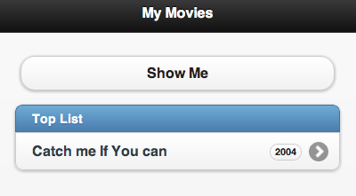

MobileHybridApp-ClassExercises
==============================

For in-class training:

### Exercise 1: Singleton is back
* Complete the code in `ex1.html`.
* See Hints before start coding!
* Click "Test All" to check your code.
* All 3 cases should be passed.  

### Exercise 2: JSON to List
* Complete the code in `ex2.html`.
* Click "Show Me" to test your code.
* Make sure your screen look similar to this with more movies:  

  

### Exercise 3: Build Page with JS
* Complete the code in `ex3.html`.
* Click "Greet Me" to view your page.
* Make sure your screen look similar to this:  

![ex3.Goal][ex3.png]
